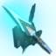

# Equipment 

You can't be a good Waker without at least some half-decent equipment. Here are some recommendations.

(harmonizers)=
## Harmonizers

There are the only current weapon series I can recommend using:

```{csv-table}
---
header: >
  "Weapon Series", "Level Req.", "Attack", "Potential", "Notes"
widths: 15, 5, 5, 20, 30
align: center
---

" \
Neos Astraean", "Lv.70", "761", "Potency +32%; Photon Blast Gauge Charge when attacking +25%; PP Consumption Reduced 15% for 90 seconds after using Photon Blast", "This is the best weapon series. It drops from Dark Falz Aegis in The Battle of Halphia Lake Urgent Quest. Getting one with a good [Preset Skill](#weapon-preset-skills) will be difficult though"

" \
Neos Justitean ", "Lv.70", "671",  "Potency +32%; Photon Blast Gauge Charge when attacking +25%; PP Consumption Reduced 15% for 90 seconds after using Photon Blast", "The next best weapon series. It is similar to Neos Astrean but has lower attack and has a Light element attribute. It is best-in-slot for enemies weak to Light (such as Dark Falz Aegis). It is also easier to get one with a good [Preset Skill](#weapon-preset-skills) that makes it surpass a blank Neos Astrean in damage output"

" \
Tenebrous ", "Lv.60", "674", "Potency +15%; Critical Hit Rate +15% for 30 sec when you successfully dodge or negate an attack with a Weapon Action or Sidestep", "This weapon is mentioned only because it is still competitive with the Neos series for enemies that are weak to Ice. Otherwise don't use this weapon series"

" \
Effulgent ", "Lv.60", "674", "Potency +15%; Critical Hit Rate +15% for 30 sec when you successfully dodge or negate an attack with a Weapon Action or Sidestep", "This weapon is mentioned only because it is still competitive with the Neos series for enemies that are weak to Fire. Otherwise don't use this weapon series"
```

(weapon-preset-skills)=
### Preset Skills

The recommended Preset Skill for weapons is Fatale for higher crit rates to mitigate [damage variance](https://pso2na.arks-visiphone.com/wiki/Portal:New_Genesis/Damage_Calculation#Weapon_Variance).
See this [weapon damage spreadsheet](https://docs.google.com/spreadsheets/d/1gZaK_zZJ2DkrsDCajCjwdVUKspokNPMvXoGgM6yOxJI) to compare the damage outputs of various Weapon Series and Preset Skills.

### Multiweapon

Multiweaponing the Harmonizer is not necessary, as it is a self-sufficient weapon that can already do everything on its own.
It has no issues with managing PP, and it already has the best mobility in the game (both vertically and horizontally) which makes a multiweapon with a PP-restoring or mobility-aiding weapon redundant.

## Armor

```{csv-table}
---
header: >
  "Armor Name", "Level Req.", "Defense", "Properties", "Notes"
widths: 15, 5, 5, 20, 30
align: center
---

" \
Eclaireur Armor", "Lv.65", "96", " +4.0% \
 +4.0% \
 +4.0% \
DMG Resist -5.0%", "This is the best armor for maximizing your damage output, but it comes at the cost of survivability and PP. Even so, Waker has no troubles managing PP, and has some skills that help with survivability to make up for the lack of HP and counteract the negative damage resist such as [Retro Friends Rescue](#retro-friends-rescue) and [Welfare Management](#welfare-management)"

" \
Ajax Armor", "Lv.70", "102", "HP +30 \
PP +5 \
 +3.5% \
 +3.5% \
 +3.5% \
DMG Resist +1.0%", "This is the best armor for casual players looking for some extra survivability. It boasts good damage characteristics in addition to PP with all its HP, defense, and Damage Resist stats"

" \
Efitus Armor: Sheza", "Lv.57", "100", "HP +30 \
PP +4 \
 +3.0% \
 +3.0%", "This is the best budget armor since it has decent damage stats, good survivability, and also **comes with the Mastery IV augment** on it (assuming you get it from a [Red Box](https://twitter.com/maka_ngs/status/1600551086720311296) or bought one from the Personal Shop with Mastery IV on it). You can stick with this armor until you can afford to upgrade to Ajax or Eclaireur"

" \
Efitus Armor: Belta", "Lv.57", "100", "HP +30 \
PP +4 \
 +3.0% \
 +3.0%", "This is the best budget armor since it has decent damage stats, good survivability, and also **comes with the Mastery IV augment** on it (assuming you get it from a [Red Box](https://twitter.com/maka_ngs/status/1600551086720311296) or bought one from the Personal Shop with Mastery IV on it). You can stick with this armor until you can afford to upgrade to Ajax or Eclaireur"
```

### Preset Skills

Preset Skills on armors are not necessary (especially given Waker's excellent PP economy) but Performa and high level Enthusia Preset Skills are considered the best.

## Augments

Halphinale is the best ale
