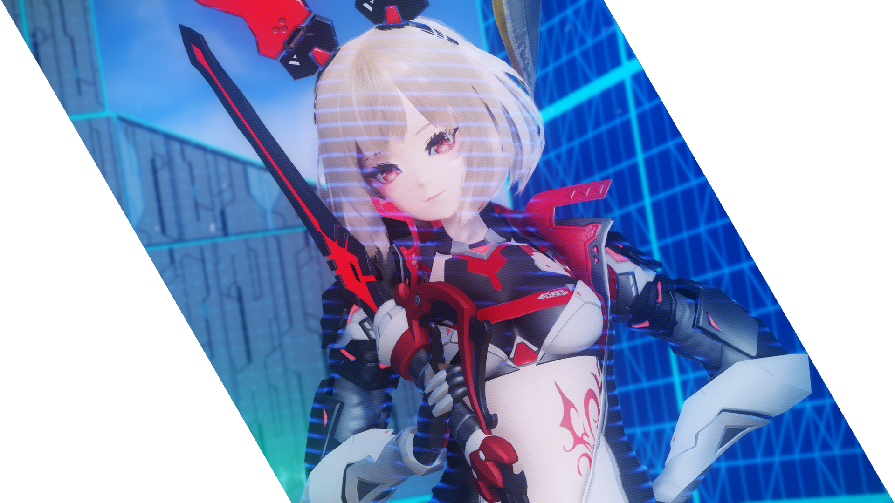

# Aikoh's Waker Guide

Written by aikohhhh

Welcome to Aikoh's comprehensive Waker class guide for Phantasy Star Online 2: New Genesis!



_In a nutshell: Waker = Summoner + Luster!_

```{video} _static/bujin_start.mp4
---
width: 100%
---
```

_Waker_ uses a [Harmonizer](#harmonizers) to summon photonic beings called _Familiars_ to attack foes or defend against incoming attacks.
Waker currently has three different Familiars: 
_Fredran_, a ranged attacker that is effective for dealing with enemies at all distances; 
_Wulfen_, a melee fighter that can unleash powerful strikes at close range; 
and _Marmelo_, a defender and counter-attacker that can block incoming attacks and deal back massive damage when thrown. 

To play Waker effectively, you need to master the use of your Familiars and their [Photon Arts](#photon-arts). 
It requires balancing the [Focus Gauges](#harmonizer-focus) of each Familiar and utilizing other [class skills](#core-skills) depending on the situation.

Waker's biggest strength lies in its versatility;
it performs well in any situation you can throw at it thanks to its variety of Familiars and skills, while also boasting some of the greatest mobility out of all the classes!
However, it is also one of the most complex and difficult classes to master due to the sheer number of mechanics involved and the unforgiving animation locks on nearly every action.
Optimal Waker gameplay requires planning out each subsequent move in order to maximize Familiar Focus Gauge accumulation while simultaneously timing each of those moves carefully in order to stay safe when fighting opponents.

But don't let the difficulty curve discourage you from trying out this awesome class!
It feels very satisfying and quite rewarding when you get a feel for the class and have that "aha!" moment when you figure out optimal combos for each encounter.
When played well, Waker competes with the likes of the other classes while being a lot more engaging than inputting a short sequence of buttons over and over again.

This guide was written to document what Waker does and how to play it effectively.  
Go on to the [Skill Tree](#skill-tree) section if you wish to learn more about Waker!

````{admonition} [Changelog (click to see full history)](https://github.com/Aikohh/aikohh.github.io/commits/main)
```{git_changelog}
```
````


```{toctree} 
---
caption: Contents
maxdepth: 2
---

skill-tree
moveset
gameplay
equipment
subclass
addons
references
credits
```

<!-- Indices and tables
==================

* {ref}`genindex`
* {ref}`modindex`
* {ref}`search`
 -->

<!--  HTML Metadata  -->

```{raw} html
<meta content="Aikoh's Waker Guide" property="og:title" />
<meta content="A comprehensive guide to the Waker class in Phantasy Star Online 2: New Genesis" property="og:description" />
<meta content="https://aikohh.github.io/" property="og:url" />
<meta content="https://aikohh.github.io/_static/class/UINGSClassWa.png" property="og:image" />
<meta content="#FF794A" data-react-helmet="true" name="theme-color" />
```
