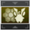
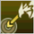

# Moveset 

Waker has many attacks available for use in combat. Here is a list of each attack and their uses.
No specific numbers are listed, as more accurate and up-to-date information can be found in [Frame Data](#frame-data).

<!--  -->


(normals)=
##  Normal Attack

A basic 3-hit attack string. Avoid using it as much as possible because it does very low damage.
However, it can quickly build [Treble Clef](#treble-clef-marking) if you are in a pinch and are unable to fit in any [Photon Arts](#photon-arts) or [Linear Drives](#linear) to build Treble Clef instead.
<!-- If you ever end up with 0 PP, 0 [Familiar Harmonies](#familiar-harmony), and no Treble Clef Mark to ignite, then Normal Attacks will get you some PP back to restart your rotation. -->
<!-- (The described scenario should never happen, and thus you should never be using Normal Attacks just for restoring PP) -->

(dodge-attack)=
## Dodge Attack

Performed by pressing the Normal Attack button immediately after a dodge.
It's quick to do and can help with positioning,
but, just like [Normal Attacks](#normals), avoid using it as much as possible due to its low damage.
It can also quickly build [Treble Clef](#treble-clef-marking) if you are in a pinch and are unable to fit in any [Photon Arts](#photon-arts) or [Linear Drives](#linear) to build Treble Clef instead.

(dive)=
##  Dive Attack

Used for positioning to let you hit the ground faster. Other than that, nothing notable at all.

(dash-attack)=
## Dash Attack

Performed by pressing the Normal Attack button during a Photon Dash. 
Fires off a photonic projectile that pierces enemies and restores PP. 
It's great to use for restoring PP against a bunch of enemies grouped together. 
It deals low DPS, so avoid using it for damage.

(counters)=
## Counter Attacks

About to get hit? You should prioritize using one of these --- namely the [Harmonizer Parry Counter](#wa-counter) --- unless you need to perform a more important action such as [throwing a Stage 2 Marmelo](#marmelo) and can protect yourself with [Hot Marmelo Parry](#hot-marmelo-parry).

(dodge-counter)=
### Dodge Counter

Performed by pressing the Normal Attack button immediately after a successful dodge.
Its DPS is roughly on par with [Photon Arts](#photon-arts) but doesn't help fill [Harmonizer Focus](#harmonizer-focus).
However, it does generate a good amount of [Treble Clef](#treble-clef-marking). 
It is generally recommended to use a [Dodge Counter](#dodge-counter) over a [Harmonizer Parry Counter](#wa-counter) if and only if Marmelo Focus is already at its maximum (Stage 2), the enemy is not Marked, and you are unable to fit in held Photon Arts to build both Treble Clef and Harmonizer Focus simultaneously.

(wa-counter)=
###  Harmonizer Parry Counter

This is your strongest counter attack, performed by pressing the Normal Attack button after a successful Weapon Action guard.
However, this attack does not generate any [Treble Clef](#treble-clef-marking).
You will need to generate Treble Clef in some other fashion --- mainly through [Photon Arts](#photon-arts) and/or [Linear Drives](#linear).

```{video} _static/skill/TrebleClefIgnition.mp4
---
width: 100%
---
```

(linear)=
##  Linear Drive

At a specific time after unleashing a [Photon Art](#photon-arts), perform a Normal Attack to unleash an extra attack that moves you toward or away from your target depending on your directional movement input (with the backwards version dealing more damage and applying more [Treble Clef](#treble-clef-marking)).
The timing is indicated by a purple glow that appears on your character shortly after finishing a Photon Art.
This is a great skill for adjusting your position, and also deals decent damage comparable to a Photon Art.
Linear Drive also restores PP, applies a good amount of Treble Clef, and has invulnerability frames at the start.
You can perform it twice in a row after a Photon Art if you have the [Linear Drive Encore](#linear-drive-encore) skill.

```{video} _static/skill/LinearDriveEncore.mp4
---
width: 100%
---
```

(marmelo)=
##  Marmelo Strike

Holding and letting go of the Weapon Action allows you to throw Marmelo at an enemy to deal damage based on Marmlo's Focus Gauge. Successful Weapon Action guards, [Hot Marmelo Parry](#hot-marmelo-parry), and [Marmelo Patience](#marmelo-patience) increase Marmelo's Focus Gauge shown above your hotbar. Marmelo's Focus Gauge has three stages: 0, 1, and 2.
Guarding one attack grants a Stage 1 Marmelo.
Guarding three attacks grants a Stage 2 Marmelo.
**Generally, you should only throw Marmelo at Stage 2.**
The current stage of Marmelo can be seen in the hotbar and also manifests in Marmelo's physical size.

```{note}
You are **very** vulnerable while throwing Marmelo because the throwing animation is not cancellable and it also has no guard frames or invulnerability frames. Be sure to have [Hot Marmelo Parry](#hot-marmelo-parry) ready just in case! (Or know your enemy well enough to time your throws without danger)
```


_Marmelo at different stages depending on the gauge. Initially, Marmelo is small at Stage 0 (indicated by the 0 bars in its gauge). After guarding one or two attacks with the Weapon Action, Marmelo advances to Stage 1, increasing in size and damage when thrown. After guarding three or more attacks, Marmelo advances to Stage 2 in which size and damage are maximized._

##  Familiar Harmony

By expending one Fredran stock and one Wulfen stock (see [Harmonizer Focus](#harmonizer-focus)), you can deal massive damage in a large cone-shaped area of effect (AoE) in front of you.
With [Familiar Harmony Marmelo+](#familiar-harmony-marmelo-plus) and a non-empty [Marmelo Focus Gauge](#marmelo-strike), Familiar Harmony will additionally consume Marmelo Focus to deal additional damage.
(See the [Skill Tree](#familiar-harmony-marmelo-plus) for additional information about Familiar Harmony Marmelo+)

It's great to use for mobbing to deal damage to a large number of enemies at once.
When using it against bosses, you should try to save Familiar Harmonies for downs, for when you can guarantee a hit onto an enemy weakspot, or when you have 1 Marmelo guard of focus and can guarantee a hit before you need to guard another attack.

You should also make sure you don't overcap on your Fredran or Wulfen stocks, otherwise the Harmonizer Focus just goes to waste instead of being used for building up another Familiar Harmony.
Familiar Harmony also restores PP and applies a [Treble Clef Mark](#treble-clef-marking) to each enemy hit if you have the [Familiar Harmony Marking Clef](#familiar-harmony-marking-clef) skill.

```{video} _static/skill/CombatFamiliarHarmony.mp4
---
width: 100%
---
```

(photon-blast)=
##  Photon Blast

Deal huge damage in a large AoE in front of you. 
It doesn't build any [Harmonizer Focus](#harmonizer-focus) or [Treble Clef](#treble-clef-marking), but it does apply a lot of down. 

```{video} _static/PA/PhotonBlast.mp4
---
width: 100%
---
```

(photon-arts)=
## Photon Arts

In general, each Photon Art has two variants: Tapped and Held.
Transitioning between a tapped and held variant of a Photon Art consumes 10 additional PP.
The tapped variants of Photon Arts don't generate much [Treble Clef](#treble-clef-marking), while the held variants of Photon Arts generate a lot of it.
Held variants of Photon Arts also generally have lenghthier animations, and thus you should utilize [Hot Marmelo Parry](#hot-marmelo-parry) to keep yourself safe from danger while executing held Photon Arts.

Wulfen's Photon Arts generally have higher DPS than Fredran's, and thus Wulfen's Photon Arts should be prioritized.

<!-- [Wulfen Demolition](#wulfen-demolition) is the only Photon Art that has three different variants (tapped, short hold, long hold), but we'll get to that. -->

(fredran-breath)=
###  Fredran Breath

#### Tapped

Summon Fredran to fire 3 photonic projectiles in front of you.
Despite firing off 3 projectiles, an enemy can only be hit once by this attack, regardless of the number of projectiles the enemy touched.
All 3 projectiles pierce targets, making it great for mobbing.

Tapped Fredran Breath is also good for filler DPS in between counters against aggressive bosses in which you need to maintain your positioning for the next counter attack opportunity. 
Just keep in mind that tapped Fredran Breath against a single target is one of the weakest attacks in your arsenal. 
[Linear Drive](#linear) deals more DPS than tapped Fredran Breath on a single target!


```{video} _static/PA/CombatFredranBreathTapped.mp4
---
width: 100%
---
```

#### Held

Fredran locks onto up to 10 targets in your field of view and fires a projectile at each one.
Unlike the tapped variant of this Photon Art, these projectiles do not pierce enemies.
If an enemy has multiple parts, Fredran will lock onto and fire a projectile at each part.
Multiple hits against the same enemy (within the same cast of held Fredran Breath) will deal reduced damage.
Despite this, Fredran Breath remains a very effective option in single target DPS scenarios against enemies with multiple parts, often surpassing [Wulfen Raid](#wulfen-raid) and [Wulfen Demolition](#wulfen-demolition) in DPS.


```{video} _static/PA/CombatFredranBreathHeld.mp4
---
width: 100%
---
```

(fredran-riding)=
###  Fredran Riding

#### Tapped

Rise into the air with Fredran and shoot out a quick flurry of 3 attacks at an enemy.
This is Fredran's highest DPS outside of held [Fredran Breath](#fredran-breath) against a target with 4 or more parts.
This Photon Art is also great for vertical positioning, as repeatedly tapping Fredran Riding will make you increase in height until you are slightly above your target.
However, this can also cause your enemy to miss attacks that you could have countered.

```{note}
If an enemy is moving quickly, tapped Fredran Riding may only land 1 or 2 of its attacks. 
In this case you may consider using tapped [Fredran Breath](#fredran-breath) which deals the entirety of its damage in one hit.
Just note that Fredran Breath has a much lower projectile speed than tapped Fredran Riding, and the large hitbox of tapped Fredran Breath can make it difficult to hit weakspots.
```

```{video} _static/PA/FredranRidingTapped.mp4
---
width: 100%
---
```

#### Held

Ride on Fredran's back indefinitely until you let go.
You will have a speed boost and be unaffected by gravity for the first 2 seconds, after which you will start slowly falling down and move at regular gliding speed.
After letting go of the button, you will jump off Fredran's back, and Fredran will charge towards your target, dealing high damage.

Although the forced movement and lengthy animations make held Fredran Riding rather clunky to use, it is still good for generating high amounts of Fredran [Harmonizer Focus](#harmonizer-focus) and [Treble Clef](#treble-clef-marking) at the same time. It can also be used for precharging during short windows of downtime that would be too short for a long held [Wulfen Demolition](#wulfen-demolition).


```{video} _static/PA/FredranRidingHeld.mp4
---
width: 100%
---
```

(wulfen-raid)=
###  Wulfen Raid

#### Tapped

A two-hit attack consisting of a dash toward your target and an uppercut strike.
The uppercut deals the bulk of this Photon Art's damage.
There are guard frames at the start of the dash attack and at the start of the uppercut strike.
You can cancel this Photon Art between the dash and the uppercut with a Dodge or a Weapon Action.

```{note}
If you have a target to lock onto, repeatedly casting and dodge-cancelling tapped Wulfen Raid after the dash attack is the fastest movement in the game!
```

Tapped Wulfen Raid is great for filler DPS in between counter attacks against aggressive enemies.
It is relatively safe to spam compared to other Photon Arts, but it still must be timed correctly because you are vulnerable near the end of the dash attack and near the end of the uppercut, during which you can not cancel with a Dodge or a Weapon Action.

```{video} _static/PA/WulfenRaidTapped.mp4
---
width: 100%
---
```

#### Held

Holding Wulfen Raid replaces the uppercut of the tapped variant with a 5-hit spin attack, and then follows with a kick.
Unless you hold the forward directional input, the kick will push you backwards. 
There is no damage difference between holding the forward directional input versus not.

There are guard frames during the final kick, and you can cancel the Photon Art during the transition between the spin attack and the kick by using a Dodge or a Weapon Action. 
Of note, cancelling the Photon Art during this transition with a Dodge does not incur DPS loss. So don't feel the need to commit to the final kick for DPS.

Held Wulfen Raid is the Photon Art you want to be using the most often, as it deals high DPS and generates a lot of Wulfen [Harmonizer Focus](#harmonizer-focus) and [Treble Clef](#treble-clef-marking). 
Although it is technically slightly less DPS than tapped Wulfen Raid (unless you are cancelling after the 5-hit spin attack with a [Counter Attack](#counters)), it is more PP efficient.

```{video} _static/PA/WulfenRaidHeldBackwards(default).mp4
---
width: 100%
---
```

```{video} _static/PA/WulfenRaidHeldForward.mp4
---
width: 100%
---
```

(wulfen-demolition)=
###  Wulfen Demolition

#### Tapped

A two-hit attack, both hitting in a small circular AoE around you.
There are guard frames at the start, and you can cancel with a Dodge or Weapon Action during the transition between the two attacks.

Tapped Wulfen Demolition is generally not used for mobbing due to its small AoE (unless enemies are very tightly grouped), and also generally not used for bossing since [Wulfen Raid](#wulfen-raid) deals more DPS (both tapped and held).
However, it is great as a tool for horizontal positioning in mid-air since you can freely move during the Photon Art animation and for a short while afterwards without losing height.
Furthermore, weakspots on specific bosses such as Lizentos' spine and Doldoris' battery can sometimes be easier to hit with a tapped Wulfen Demolition than Wulfen Raid.

```{video} _static/PA/WulfenDemolitionTapped.mp4
---
width: 100%
---
```

#### Short Hold

Holding Wulfen Demolition for roughly half a second will replace the second hit in the tapped variant with a charging animation, during which Wulfen will follow you around.
Letting go of Wulfen Demolition will have Wulfen leave a lingering shockwave attack (in the shape of a circle) at your current position that deals 10 instances of damage over time.
There can only be once instance of a shockwave at a time, so you do not want to spam this Photon Art.
It is best used alongside other Photon Arts to maximize your damage output against enemies that stay in place long enough to get hit by all 10 instances of damage from the shockwave. 

```{video} _static/PA/WulfenDemolitionShortHold.mp4
---
width: 100%
---
```

#### Long Hold

Holding Wulfen Demolition for roughly 3 seconds will supercharge Wulfen.
Letting go of Wulfen Demolition will unleash a large AoE attack centered around you.
There are guard frames on the release of this attack.

This Photon Art is primarily used for precharging during periods of downtime between enemy spawns or when a boss is not able to be hit for a while.
It can also be used while mobbing for filling up your Wulfen [Harmonizer Focus Gauge](#harmonizer-focus) quickly, since it has a large AoE and generates a lot of Harmonizer Focus for each enemy it hits.

```{note}
An enemy hit by a long-held Wulfen Demolition will instantly become [Marked](#treble-clef-marking)!
```

Another tip with this attack is, in some cases, you can utilize the Encore Jump [Add-on Skill](#add-on-skills) from the Bouncer class to deal damage while charging Wulfen Demolition.

```{video} _static/PA/WulfenDemolitionLongHold.mp4
---
width: 100%
---
```

(frame-data)=
## Frame Data

For specific Potency distributions, Physical down, Elemental down, Familiar Focus Gauge, Treble Clef, timings on attack animation lengths, invulnerability frames, and guard frames for each attack, refer to the following frame data spreadsheets:
* [NGS Verification Data Storage](https://docs.google.com/spreadsheets/d/1_OgubzM5QFe4rua4Xu0GSMAI8Idoq8r2yI8Ioyec6oY/edit#gid=932674549)
* [PSO2NGS Frame Data](https://docs.google.com/spreadsheets/d/1YEg-6eViChVV7HDDlNlgFPJf3qbyIUeAlLYPr9b99t0/edit#gid=329460957)


```{raw} html
<meta content="Waker's Moveset" property="og:title" />
<meta content="Waker has a wide variety of attacks it can utilize in combat. Here is a breakdown of each one and how they should be used." property="og:description" />
<meta content="https://aikohh.github.io/moveset.html" property="og:url" />
<meta content="https://aikohh.github.io/_static/class/UINGSClassWa.png" property="og:image" />
<meta content="#FF794A" data-react-helmet="true" name="theme-color" />
```
