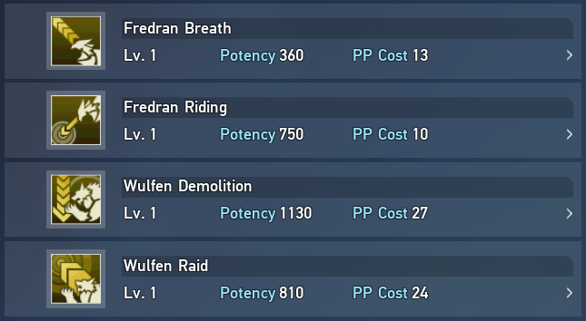

# Photon Arts 

```{warning}
This page is incomplete.
```



(fredran)=
## Fredran

Fredran is ranged

(wulfen)=
## Wulfen

Wulfen is melee

(frame-data)=
## Frame Data

For specific timings, damage distributions, physical down, elemental down, and familiar focus gauge gain values for each Photon Art, refer to the following frame data spreadsheets:
* [NGS Verification Data Storage](https://docs.google.com/spreadsheets/d/1_OgubzM5QFe4rua4Xu0GSMAI8Idoq8r2yI8Ioyec6oY/edit#gid=932674549)
* [PSO2NGS Frame Data](https://docs.google.com/spreadsheets/d/1YEg-6eViChVV7HDDlNlgFPJf3qbyIUeAlLYPr9b99t0/edit#gid=329460957)