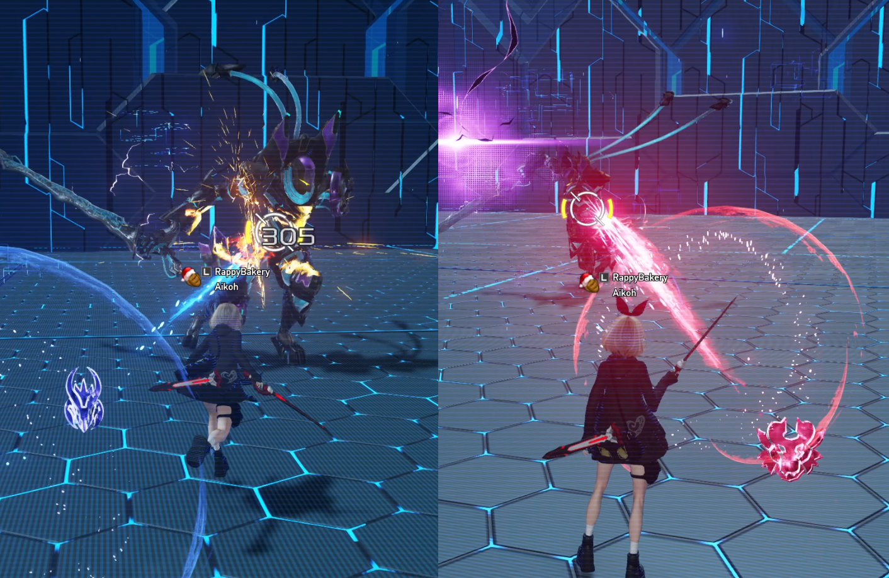

# Skill Tree 

Depicted below is Waker's skill tree and an example skill-point allocation among the skills.  
Afterwards each skill is explained in detail and with some general tips given when they apply.


(core-skills)=
## Core Skills

These are the skills that you should always take.

(harmonizer-focus)=
###  Harmonizer Focus
Unlocks the Focus Gauges for Fredran (blue) and Wulfen (red). 
Increase the Focus Gauges by using their respective [Photon Arts](#photon-arts) or by having a [Familiar Support](#familiar-support) of the corresponding Familiar.
Completely filling one gauge grants a _stock_ for that Familiar.
Up to 2 stocks can be gained by default.

```{note}
Different types of enemies generate more or less Harmonizer Focus when attacked.
Generally, attacking weaker enemies (mobs) will generate less focus than attacking a boss enemy.
```

  
_Harmonizer Focus unlocks Fredran and Wulfen's Focus Gauges, shown above the hotbar. The blue and red numbers indicate the number of stocks of Fredran and Wulfen focus respectively._

###  Harmonizer Focus Extra 
Increases the maximum number of Harmonizer Focus stocks to 3 for both Fredran and Wulfen.

(familiar-harmony)=
###  Familiar Harmony 
Allows you to expend one Fredran stock and one Wulfen stock to deal massive damage in a large cone-shaped area of effect (AoE) in front of you.

```{video} _static/skill/CombatFamiliarHarmony.mp4
---
width: 100%
---
```

###  Call Again PP Preservation 
Reduced PP consumption after using Familiar Harmony. It's good for managing your PP.

(treble-clef-marking)=
###  Treble Clef Marking 
Hitting the same enemy enough times will accumulate Treble Clef until the enemy becomes afflicted with a Mark.
Marked enemies take increased damage (+3%) and down (+20% to both Physical and Elemental Down Factors) from Harmonizer [Photon Arts](#photon-arts).
Different attacks apply differing amounts of Treble Clef (see [Frame Data](#frame-data)).
The Mark lasts for 30 seconds unless its duration is refreshed by attacking the enemy again, or it is removed using [Treble Clef Ignition](#treble-clef-ignition)

```{note}
The increased damage and down factor on Marked enemies only applies to your own Harmonizer [Photon Arts](#photon-arts)!
Attacks from other players, attacks from other weapon types, Familiar Harmony, Marmelo, Normal Attacks, etc. do not benefit.
```


(treble-clef-ignition)=
###  Treble Clef Ignition 
Holding down the Normal Attack button after performing a Normal Attack, [Linear Drive](#linear-drive), [Dodge Attack](#dodge-attack), [Dodge Counter](#dodge-counter), or [Harmonizer Parry Counter](#harmonizer-parry-counter) will spawn a small AoE attack that detonates the Mark on all Marked enemies caught in its radius, dealing a sizable amount of damage.

```{note}
You should generally try to only perform an ignition after a [Linear Drive](#linear-drive) or [Harmonizer Parry Counter](#harmonizer-parry-counter) because these are the highest damage-per-second (DPS) among the other options. 
However, performing an ignition after a [Dodge Attack](#dodge-attack) or [Dodge Counter](#dodge-counter) is also acceptable if you are cancelling a [Photon Art](#photon-arts) to ignite a Mark as quickly as possible.
```

```{video} _static/skill/TrebleClefIgnition.mp4
---
width: 100%
---
```

(familiar-harmony-marking-clef)=
###  Familiar Harmony Marking Clef 
[Familiar Harmony](#familiar-harmony) will Mark an enemy. Enables some new rotations that upkeep both the [Treble Clef Mark](#treble-clef-marking) and [Familiar Support](#familiar-support) simultaneously to increase [Photon Art](#photon-arts) damage output, physical/elemental down application, and [Harmonizer Focus](#harmonizer-focus) generation to use more Familiar Harmonies.

(familiar-support)=
###  Familiar Support 
After activating [Treble Clef Ignition](#treble-clef-ignition), you will summon a _crest_ that periodically inflicts damage to your target.
This damage also accumulates [Harmonizer Focus](#harmonizer-focus) for Fredran or Wulfen.
The particular Familiar it accumulates Harmonizer Focus for is determined by the last [Photon Art](#photon-arts) used before activating Treble Clef Ignition. (e.g., using a Fredran Photon Art before Treble Clef Ignition will summon a blue Fredran crest that periodically attacks to increase the Fredran Focus Gauge)
The crest lasts for 20 seconds or until you die.


_Fredran crest on the left (blue), Wulfen crest on the right (red)._

(familiar-support-amplifier)=
###  Familiar Support Amplifier 
Each time a crest is summoned while one is already active, the amount of Harmonizer Focus the crest generates with each attack is amplified.
You can amplify crests up to 2 times, each time boosting the Harmonizer Focus Gauge rate by +50% up to the maximum +100%.
You can visually tell that a crest is amplified based on how purple-colored it is.
A crest retains its amplification level until the crest naturally expires after 20 seconds, or you die.
If you let the crest expire, a new crest you summon will not be amplified and it will need to be amplified again.

```{note}
The summoned crest does not need to be for the same Familiar as the crest that was already active in order to amplify it; you can alternate between Fredran and Wulfen crests while amplifying the crest. (e.g., Fredran crest -> Wulfen crest -> Fredran crest will create a maximally-amplified Fredran crest) 
```


_Non-amplified Wulfen crest on the left. 50% amplified Wulfen crest in the middle. 100% amplified Wulfen crest on the right._

(marmelo-strike)=
###  Marmelo Strike 
Allows you to throw Marmelo by holding and letting go of the Weapon Action, and unlocks Marmelo's Focus Gauge.
Unlike Wulfen and Fredran's Focus Gauges, Marmelo's Focus Gauge is only increased by guarding an attack with the Weapon Action, [Hot Marmelo Parry](#hot-marmelo-parry), or [Marmelo Patience](#marmelo-patience).
Marmelo's Focus Gauge increases depending on the number of attacks Marmelo successfully guarded.
Guarding one attack grants a Stage 1 Marmelo.
Guarding three attacks grants a Stage 2 Marmelo.
Generally, you should only throw Marmelo at Stage 2.
The current stage of Marmelo can be seen in the hotbar and also manifests in Marmelo's physical size.


_Marmelo at different stages depending on the gauge. Initially, Marmelo is small at Stage 0 (indicated by the 0 bars in its gauge). After guarding one or two attacks with the Weapon Action, Marmelo advances to Stage 1, increasing in size and damage when thrown. After guarding three or more attacks, Marmelo advances to Stage 2 in which size and damage are maximized._

(hot-marmelo-parry)=
###  Hot Marmelo Parry 
Adds an active skill you can activate at _any_ time to have Marmelo guard an attack for you.
If Hot Marmelo Parry successfully guards an attack, it increases Marmelo's Focus Gauge by one.
Hot Marmelo Parry does not interrupt your own attacks, but it does have _hitstop_ which slows your actions when Marmelo guards an attack.

```{video} _static/skill/HotMarmeloParry.mp4
---
width: 100%
---
```
_Using Hot Marmelo Parry to execute a held Wulfen Raid Photon Art without interruption._

```{note}
Although Hot Marmelo Parry does not interrupt your attacks, it _can_ interrupt transitions between tapped and held variants of certain actions. This includes the transition between guarding with Marmelo and getting ready to throw Marmelo by holding down the Weapon Action, or transitioning between the tapped and held variants of [Photon Arts](#photon-arts).
Hot Marmelo Parry **also grants a short period of invincibility frames** after it guards an attack, which may not be desired.
```

```{video} _static/skill/HotMarmeloParryCancellingHold.mp4
---
width: 100%
---
```
_Activating Hot Marmelo Parry too early interrupts Wulfen Raid's transition from its tapped variant to its held variant, which results in a second tapped Wulfen Raid as opposed to a held Wulfen Raid._

###  Hot Marmelo Parry Short Cooldown 
If Hot Marmelo Parry did not guard an attack, its cooldown is reduced. 
It is good to have in case you use Hot Marmelo Parry preemptively or dodged an attack you thought would have hit.

(marmelo-patience)=
###  Marmelo Patience 
While you have Marmelo held out by holding the Weapon Action, you take reduced damage, are immune to knockbacks and launches, and taking a hit from an attack increases Marmelo's gauge (with a cooldown of 1 second).
Enables opportunities where you can pre-aim and then throw Marmelo when anticipating a non-lethal attack.
You can use it if you're too lazy to otherwise time perfect Weapon Action guards, and don't mind spending a Restasigne to heal back up.
Just keep in mind that Marmelo Patience won't allow you to utilize [Harmonizer Parry Counter](#harmonizer-parry-counter).

Also this skill sometimes has a habit of not working :)

```{video} _static/skill/MarmeloPatience.mp4
---
width: 100%
---
```

###  Harmonizer Parry PP Gain 
Regain PP when you successfully guard with the Weapon Action.
Does not apply to [Hot Marmelo Parry](#hot-marmelo-parry) or [Marmelo Patience](#marmelo-patience).

(harmonizer-parry-counter)=
###  Harmonizer Parry Counter 
Performing a Normal Attack after successfully guarding an attack with the Weapon Action unleashes a strong counter attack.
Can not be performed after a successful guard with [Marmelo Patience](#marmelo-patience) or [Hot Marmelo Parry](#hot-marmelo-parry).

(linear-drive)=
###  Linear Drive 
At a specific time after unleashing a [Photon Art](#photon-arts), perform a Normal Attack to unleash an extra attack that moves you toward or away from your target depending on your directional movement input (with the backwards version dealing more damage and applying more [Treble Clef](#treble-clef-marking)).
The timing is indicated by a purple glow that appears on your character shortly after finishing a Photon Art.
This is a great skill for adjusting your position, and also deals decent damage comparable to a Photon Art.
Linear Drive also restores PP, applies a good amount of Treble Clef, and has invulnerability frames at the start.

```{video} _static/skill/LinearDrive.mp4
---
width: 100%
---
```

(linear-drive-encore)=
###  Linear Drive Encore 
Allows you to use Linear Drive twice in a row after a single [Photon Art](#photon-arts) instead of only a single time.

```{video} _static/skill/LinearDriveEncore.mp4
---
width: 100%
---
```

(optional-skills)=
## Optional Skills

These are the skills you dump the rest of your skill points into after taking all the [Core Skills](#core-skills).

(retro-friends-rescue)=
###  Retro Friends Rescue 
When you take damage, you have a chance to reduce the overall amount of damage taken. 
It's nice to have, and can sometimes save you from death.

(welfare-management)=
###  Welfare Management 
Reduces the damage you take and increases the amount Restasignes heal when your health is below a certain threshold. Also nice to have.

###  Resta Effect Continuance 
Trades away instant Restasigne HP restoration to add a healing over time effect that makes Restasignes heal an overall greater amount of HP.
It is personal preference how many points you put into this, but generally I prefer instant healing rather than healing over time, even if waiting for the heal over time will restore more HP per Restasigne used.
The reasoning is that I often never run out of Restasignes anyways, and when I do use a Restasigne it is usually mid-combat where I need instant healing to prepare for another incoming attack that I might not avoid (either intentionally or accidentally).

###  Lucky Sign 
Gives a chance to not a consume Restasigne when you use one. Very nice.

###  Marmelo Strike Tracing 
Allows Marmelo to change direction mid-flight after throwing with [Marmelo Strike](#marmelo-strike).
I have not found a scenario where Marmelo would hit while having this skill versus not having it. 
See this [Tweet](https://twitter.com/Aikoh_PSO2/status/1558529787756351489) and the two clips below as examples.
However, since we have a plethora of skill points, it does not hurt to take it in case it actually does help sometimes.

```{video} _static/skill/MarmeloStrikeTracingMissesEngoukuDash.mp4
---
width: 100%
---
```

```{video} _static/skill/MarmeloStrikeTracingMissesEngoukuJump.mp4
---
width: 100%
---
```

```{raw} html
<meta content="Waker Skill Tree" property="og:title" />
<meta content="How to allocate skill points in the Waker skill tree, and a brief explanation of each skill with some tips along the way." property="og:description" />
<meta content="https://aikohh.github.io/skill-tree.html" property="og:url" />
<meta content="https://aikohh.github.io/_static/class/UINGSClassWa.png" property="og:image" />
<meta content="#FF794A" data-react-helmet="true" name="theme-color" />
```
